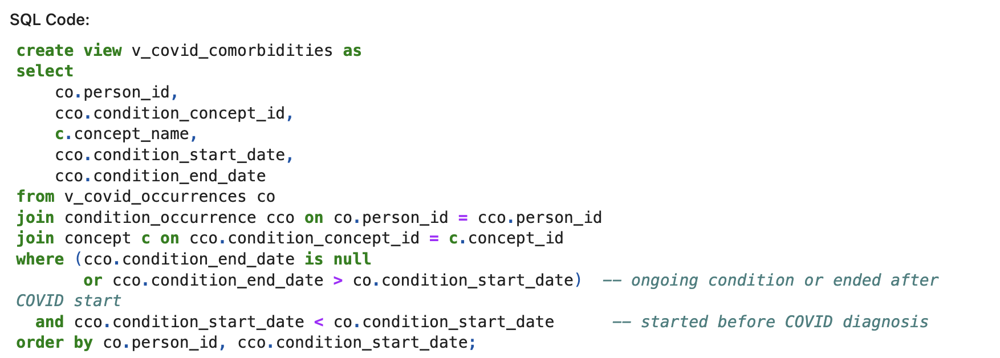
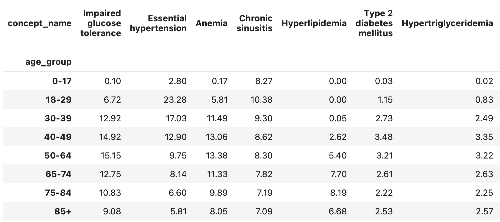
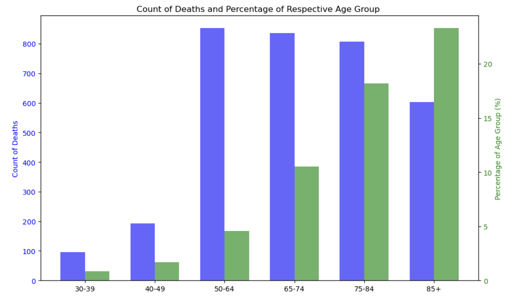
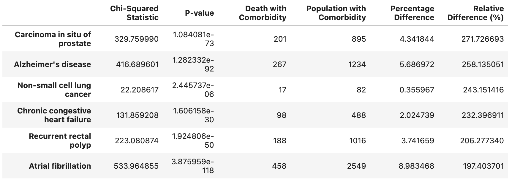
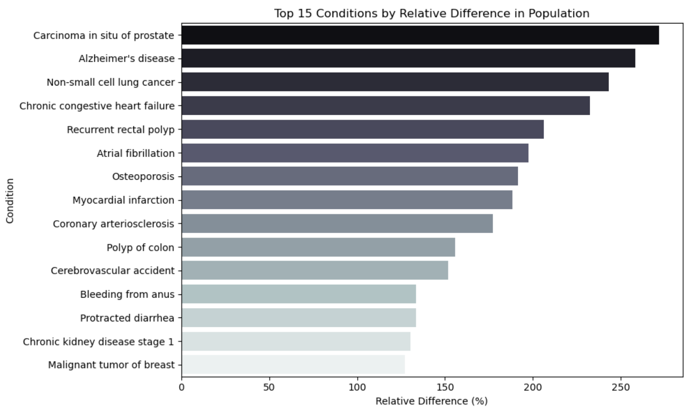

# COVID-19 Comorbidities Analysis 

This repository contains a data analysis project focused on understanding the relationship between pre-existing comorbidities and COVID-19 outcomes, using synthetic healthcare data from [Synthea](https://synthetichealth.github.io/synthea/). The analysis aims to identify common comorbidities in COVID-19 patients and determine their influence on outcomes such as death or hospitalization.

    
    

## Project Overview

In this project, we:
- Manage OMOP data in a PostgreSQL database
- Build and retrieve customized views of relevant data
- Explore demographic structure of COVID-19 patients.
- Analyze common comorbidities and their distribution across different age groups.
- Investigate differences in the prevalence of comorbidities between survivors and non-survivors.
- Determine statistically significant relationships between comorbidities and death using the Chi-Square test.

This is a work in progress, and the analysis will continue to evolve as more insights are discovered.

## Data Retrieval

### Source of Data
The data is retrieved from a PostgreSQL database built on the OMOP Common Data Model, populated with synthetic healthcare data from Synthea. We use **SQLAlchemy** to query the database and retrieve data for analysis.

### Views Used:
The following views are queried directly from the database using SQLAlchemy:
- `v_covid_occurrences`: Contains the first COVID-19 diagnosis for each patient.
- `v_covid_person`: Contains demographic data (age, gender, race, etc.) for patients diagnosed with COVID-19.
- `v_covid_comorbidities`: Lists ongoing conditions present before or during COVID-19 diagnosis.
- `v_covid_deaths`: Records all deaths among patients diagnosed with COVID-19.
- `v_covid_drug_exposures`: Captures drug treatments administered during COVID diagnosis.
- `v_covid_procedures`: Captures medical procedures performed during the COVID-19 diagnosis period.

Sample SQL:

## Structure

### Data Extraction
1. **SQL Queries and Views:** The data is retrieved from PostgreSQL views that pre-process the necessary information for analysis.
   - Isolating COVID-19 occurrences.
   - Extracting demographic data from `v_covid_person`.
   - Extracting comorbidities, death records, and related conditions (`v_covid_comorbidities`, `v_covid_deaths`).

2. **Python & SQLAlchemy:**
   - SQLAlchemy is used to create connections to the PostgreSQL database.
   - Queries are run to load data from the views into Pandas DataFrames.
   - The DataFrames are then saved as CSV files for analysis.

3. **CSV Files:** The CSV files are loaded in a separate analysis notebook where further merging, cleaning, and analysis are performed.

## Analysis Outline

### Loading and Merging Datasets
- The first two data tables were loaded in and inspected
- Load `df_occurrences` (from `v_covid_occurrences`) and `df_person` (from `v_covid_person`) CSV files
- Merge `df_comorbidities` and `df_deaths` CSV files for further analysis.

### Exploring Demographics
- Visualize and explore demographic data: age, gender, ethnicity, and race.
- Group patients by age ranges (e.g., 30-39, 40-49) for better comparison.

### Comorbidity Analysis
- Explore the most common comorbidities present in the COVID-19 positive population.
- Filter and clean redundant or flawed conditions (e.g., diabetes or miscarriage).

The most common conditions in each age group by percentage:

### Mortality Analysis
- Explore the death data, removing duplicates and non-COVID related deaths.
- Visualize deaths across different age groups.

### Statistical Testing
- Use Chi-Square tests to compare the prevalence of comorbidities in the general COVID-19 positive population and those who passed away.
- Identify statistically significant differences between these two groups.
  
Some of the most significant comorbidities:

Significant comorbidities plotted with relative difference between deceased group and population:

## Future Work
- Incorporate medication and procedure data into the analysis to explore their impact on COVID-19 outcomes.
- Investigate findings such as increased prevalence of appendicitis and substance abuse in the deceased population.
- Consider further exploration into mental health conditions and their role in COVID-19 outcomes.
- Explore potential confounding factors like socioeconomic status and other health disparities.
